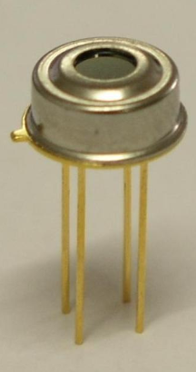
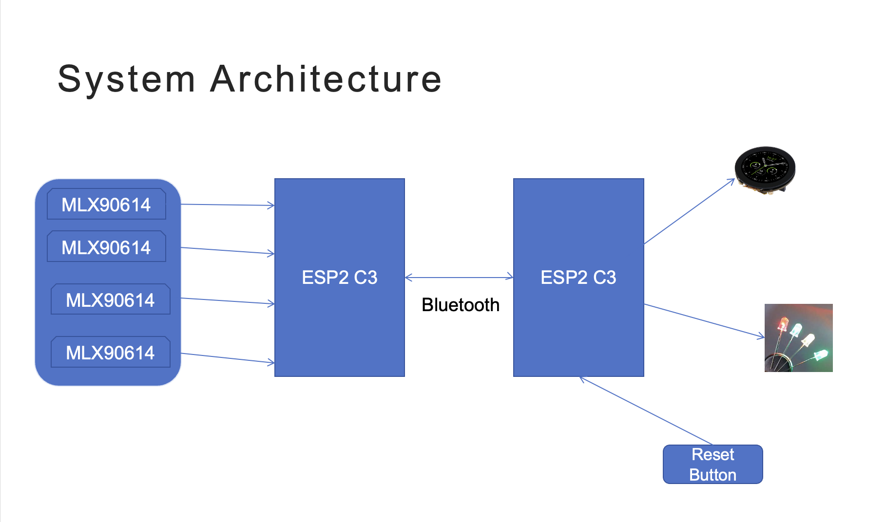
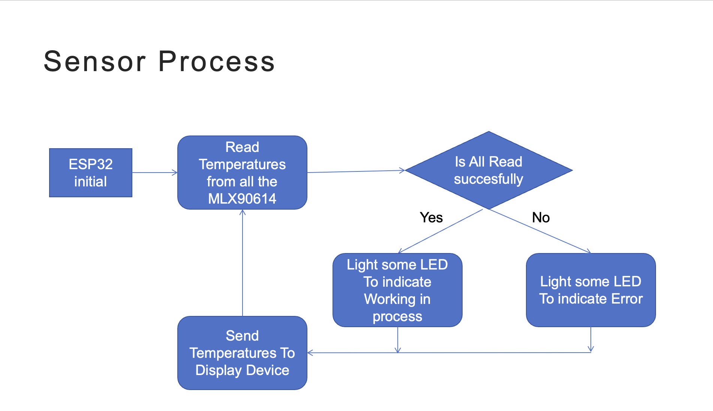
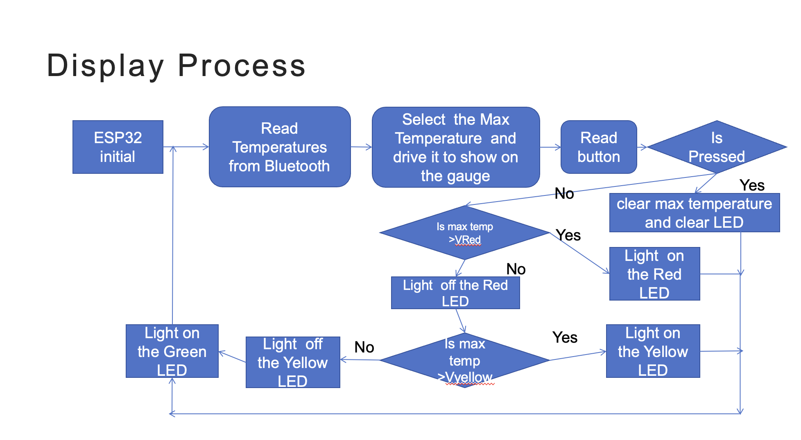

# CookTempMonitor-
Induction Cooktop temperature Monitor

# Background & Introduction
CookTemp Monitor is a smart safety reminder system designed to monitor and display the temperature of induction cooktop after cooking. The system uses four infrared temperature sensors installed above the cooktop to continuously track the temperature in four different zones. After cooking, when the cooktop is turned off, it's impossible to visually assess the temperature of the surface. Our system provides a solution by detecting the temperature in each zone and displaying it on a safety panel. Additionally, an LED light alerts users when the temperature exceeds safe limits, helping to reduce the risk of burns or fire hazards. (Sorry - im actually considering to have 1 infrared temperature sensor or 4 sensores).

## Sensor Device
The CookTemp Monitor includes four infrared temperature sensors, each dedicated to monitoring the temperature of one specific zone on the cooktop. These sensors are installed above the cooktop and continuously measure the temperature of the cooking surface. By using infrared technology, they can detect the surface temperature without any physical contact.  

1. Temperature Reading:
The ESP32 reads temperature data from MLX90614 infrared sensor. The sensor monitors the target cooktop area and provides two types of temperature data:
Ambient Temperature: The surrounding air temperature.
Object Temperature: The surface temperature of the cooktop.
The sensor is positioned to monitor a specific cooktop zone.
2. State Evaluation:
The ESP32 determines the status of the cooktop based on the measured temperature:
Safe: Temperature is below 40°C.
Warning: Temperature is between 40°C and 60°C.
Danger: Temperature exceeds 60°C.
3. Bluetooth Communication:
The ESP32 sends real-time temperature data and the cooktop status (safe, warning, or danger) to the Display Device via Bluetooth.

MLX90614 infrared sensor

## Display Device

The display device is located near the cooktop and shows the real-time temperature of each of the four zones. It features a stepper-motor-driven gauge needle that moves to indicate the temperature zone of each region. The gauge needle moves along a gradient, showing the temperature in the green, yellow, or red zones based on the current readings.

1. Data Reception:
The Display Device receives temperature and status information from the Sensor Device via Bluetooth.
2. Gauge Display:
A stepper motor-driven gauge displays the measured temperature.
The temperature range 0°C to 120°C is mapped to a needle angle range of 0° to 180°.
3. LED Alerts:
The Display Device uses LED indicators to show the cooktop’s current state:
Green LED: Safe (below 40°C).
Yellow LED: Warning (40°C to 60°C).
Red LED: Danger (above 60°C).
4. Alert Clearing:
If the red LED is lit (indicating a dangerous temperature), pressing the button clears the alert, turns off the red LED, and resets the display to its normal state.

## Device Communication

The CookTemp Monitor uses Bluetooth to communicate between the temperature sensing device and the display device. The four infrared temperature sensors continuously measure the temperature of each zone on the cooktop. Once the sensors collect the temperature data, it is sent wirelessly via Bluetooth to the display device, where it is processed and shown in real-time.

### Communication Flow Diagram

The sensor and display are commnunicate through BLE by 2  ESp32C3.
1. **Temperature Sensing:** The infrared temperature sensors detect the temperature of each zone on the cooktop.
2. **Data Transmission:** The temperature data is transmitted wirelessly via Bluetooth using the ESP32 module from the sensor device to the display device.
3. **Data Display:** The display device processes the data and shows it on the display panel, including the stepper motor gauge needle and LED warnings if the temperature exceeds safe limits.

System Architecture

Sensor Architecture 

Display Architecture

## Hardware List
Sensor Device:
1. ESP32 Development Board (Model: ESP32-C3)
2. Infrared Temperature Sensors (Model: MLX90614)
3. Power Source for ESP32 (Model: Rechargeable 3.7V Li-ion Battery)
4. Enclosure for Sensor Device (Material: 3D-printed PLA/ABS plastic or aluminum (high temperature resistant))

Display Device:
1. ESP32 Development Board (Model: ESP32-C3)
2. Stepper Motor with Driver Board (Model: TBC)
3. LED Indicators (Model: Standard 5mm LEDs (Green, Yellow, Red))
4. Push Button (Model: Standard momentary push button)
5. Power Source for Display Device (Model: Rechargeable 3.7V Li-ion Battery)
6. Enclosure for Sensor Device (Material: 3D-printed PLA/ABS plastic or aluminum (high temperature resistant))

