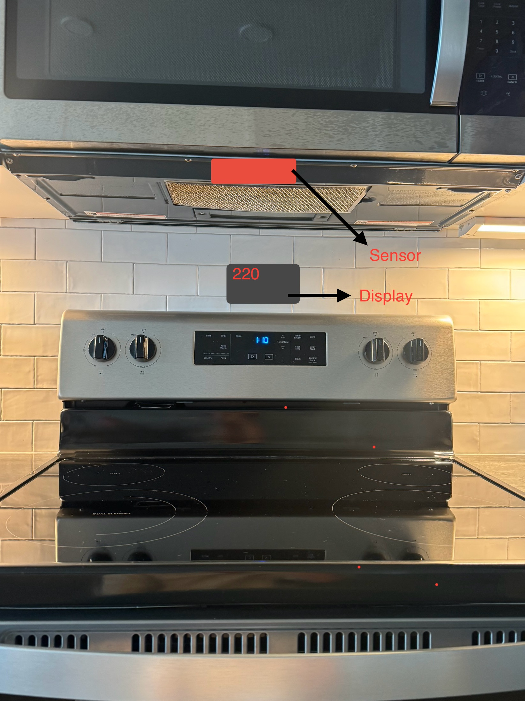
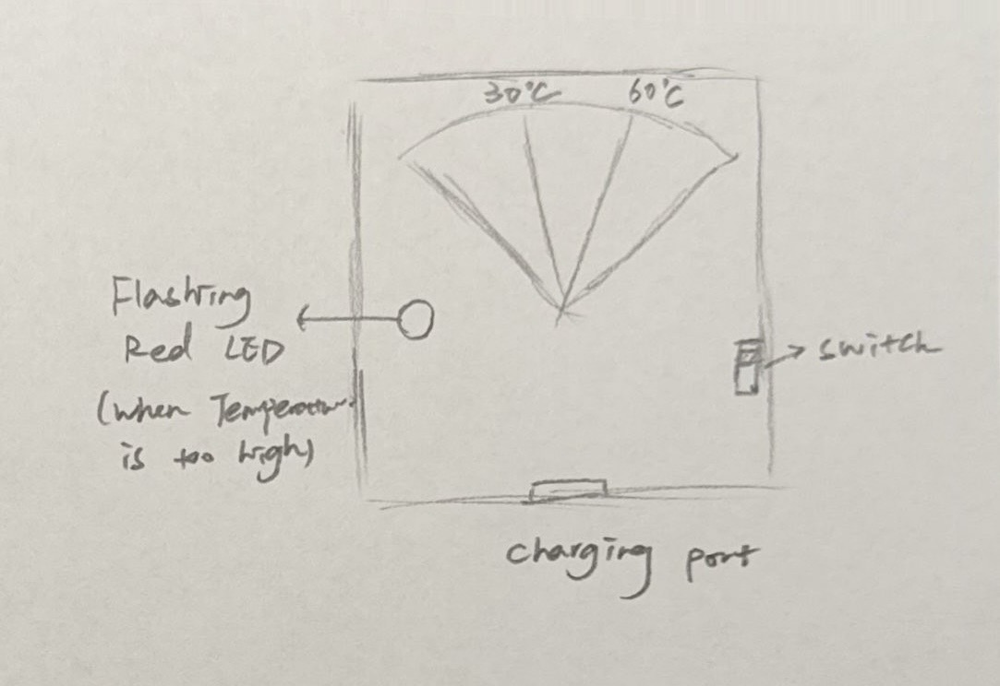

# CookTempMonitor-
Induction Cooktop temperature Monitor

# Background & Introduction
CookTemp Monitor is a smart safety reminder system designed to monitor and display the temperature of induction cooktop after cooking. The system uses four infrared temperature sensors installed above the cooktop to continuously track the temperature in four different zones. After cooking, when the cooktop is turned off, it's impossible to visually assess the temperature of the surface. Our system provides a solution by detecting the temperature in each zone and displaying it on a safety panel. Additionally, an LED light alerts users when the temperature exceeds safe limits, helping to reduce the risk of burns or fire hazards.

## Sensor Device
The CookTemp Monitor includes four infrared temperature sensors, each dedicated to monitoring the temperature of one specific zone on the cooktop. These sensors are installed above the cooktop and continuously measure the temperature of the cooking surface. By using infrared technology, they can detect the surface temperature without any physical contact. 

Each sensor is responsible for one of the four zones, ensuring that every part of the cooktop is accurately monitored. The sensors transmit the temperature data to the display device via wireless communication, providing real-time updates.

## Display Device

The display device is located near the cooktop and shows the real-time temperature of each of the four zones. It features a stepper-motor-driven gauge needle that moves to indicate the temperature zone of each region. The gauge needle moves along a gradient, showing the temperature in the green, yellow, or red zones based on the current readings.

If the temperature exceeds safe levels (e.g., 60°C), a red LED light activates to alert the user visually, ensuring safety. The display provides an easy-to-read, real-time update of the cooktop’s status, preventing potential hazards by informing the user when it’s too hot to touch.

## Device Communication

The CookTemp Monitor uses Bluetooth to communicate between the temperature sensing device and the display device. The four infrared temperature sensors continuously measure the temperature of each zone on the cooktop. Once the sensors collect the temperature data, it is sent wirelessly via Bluetooth to the display device, where it is processed and shown in real-time.

### Communication Flow Diagram

The sensor and display are commnunicate through BLE by 2  ESp32C3.
1. **Temperature Sensing:** The infrared temperature sensors detect the temperature of each zone on the cooktop.
2. **Data Transmission:** The temperature data is transmitted wirelessly via Bluetooth using the ESP32 module from the sensor device to the display device.
3. **Data Display:** The display device processes the data and shows it on the display panel, including the stepper motor gauge needle and LED warnings if the temperature exceeds safe limits.

